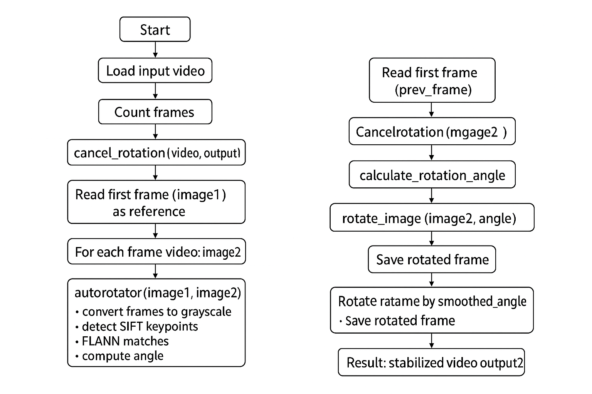

# Video Stabilization and Auto-Rotation Script

## Overview
This script is designed for automatic stabilization and rotation correction of videos. It uses computer vision algorithms with OpenCV, including the SIFT detector for keypoint detection and FLANN for descriptor matching. The script allows you to:

- Automatically correct frame rotation relative to the first frame.
- Smooth angular fluctuations for a more stable video.
- Count frames and measure video processing speed.

**This project was created as part of the course "Intelligent Data Processing" at the National Research University Higher School of Economics (NRU HSE / НИУ ВШЭ).**

## Requirements
- Python 3.9+
- OpenCV (`cv2`)
- NumPy

Install dependencies with:
```bash
pip install opencv-python-headless numpy
```

## Usage

### Example Run
```python
input_vid = 'video5429499283948714472.mp4'
output1 = 'output1.mp4'
output2 = 'output_final.mp4'

num_frames = count_frames(input_vid)
start_time = time.time()
cancel_rotation(input_vid, output1)
stabilize_video(output1, output2, 15)
end_time = time.time()

print("Total number of frames:", num_frames)
print("Processing time:", end_time - start_time, "seconds")
print("Frames processed per second:", num_frames / (end_time - start_time))
```

### Functions
- `rotate_image(image, angle)` - Rotates an image by the given angle.
- `calculate_rotation_angle(frame1, frame2)` - Computes the rotation angle between two frames.
- `autorotator(image1, image2)` - Returns the second frame aligned to the first.
- `cancel_rotation(video_name, output_name)` - Corrects rotation for every video frame.
- `stabilize_video(input_video, output_video, smoothing_window)` - Smooths frame angles to stabilize the video.
- `count_frames(video_path)` - Returns the number of frames in a video.

## Parameters
- `input_video` - Path to the input video file.
- `output_video` - Path where the processed video will be saved.
- `smoothing_window` - Number of frames used for smoothing rotation in stabilization (default: 5).

## Scheme



## Notes
- The script works best with videos that have sufficient features for SIFT keypoint detection.
- If not enough matches are found between frames, rotation correction may be skipped for those frames.
- Adjust `smoothing_window` for smoother results depending on video content.

